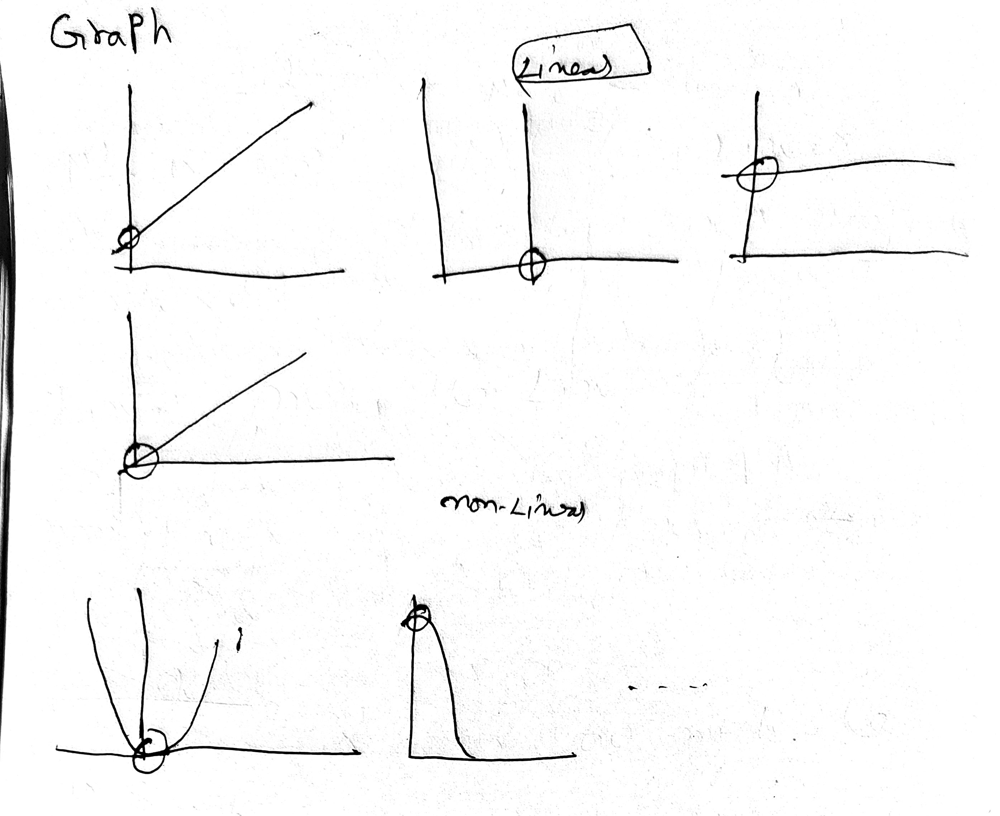
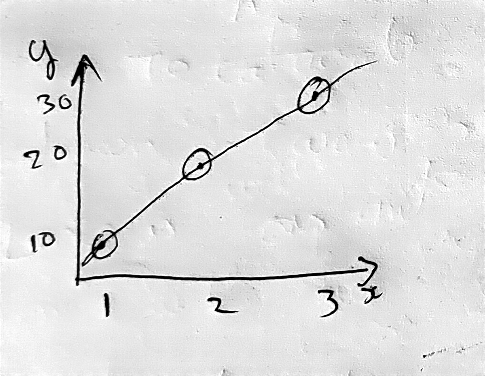
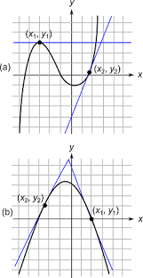
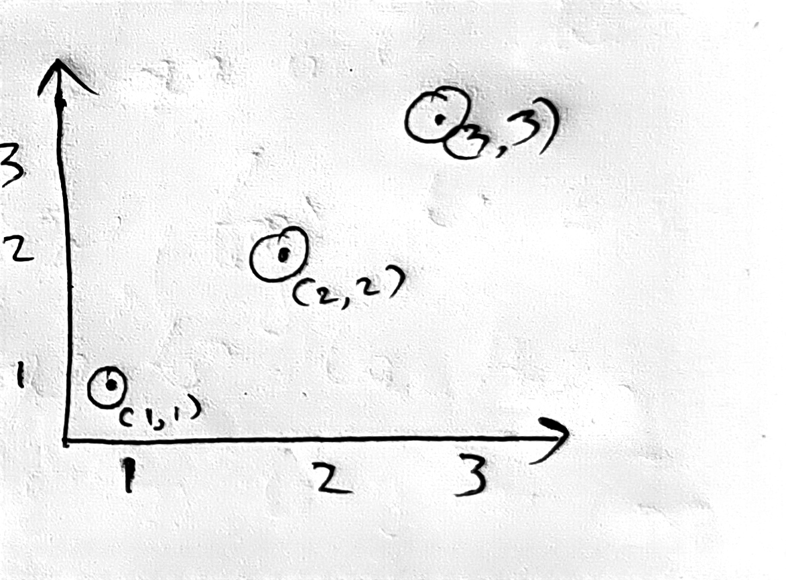
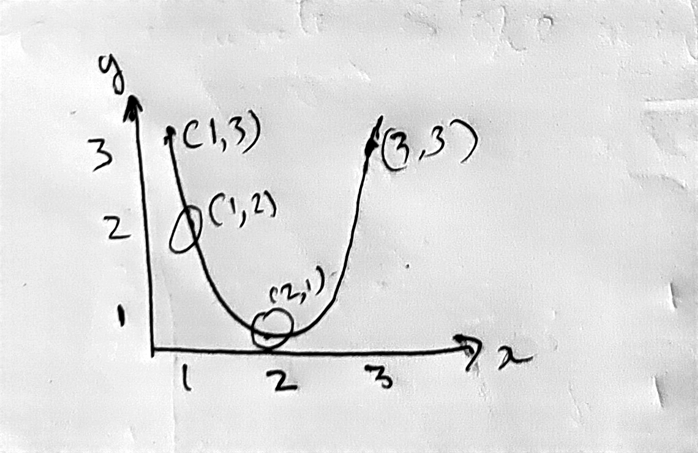
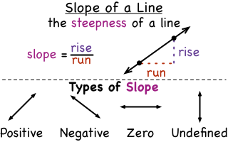
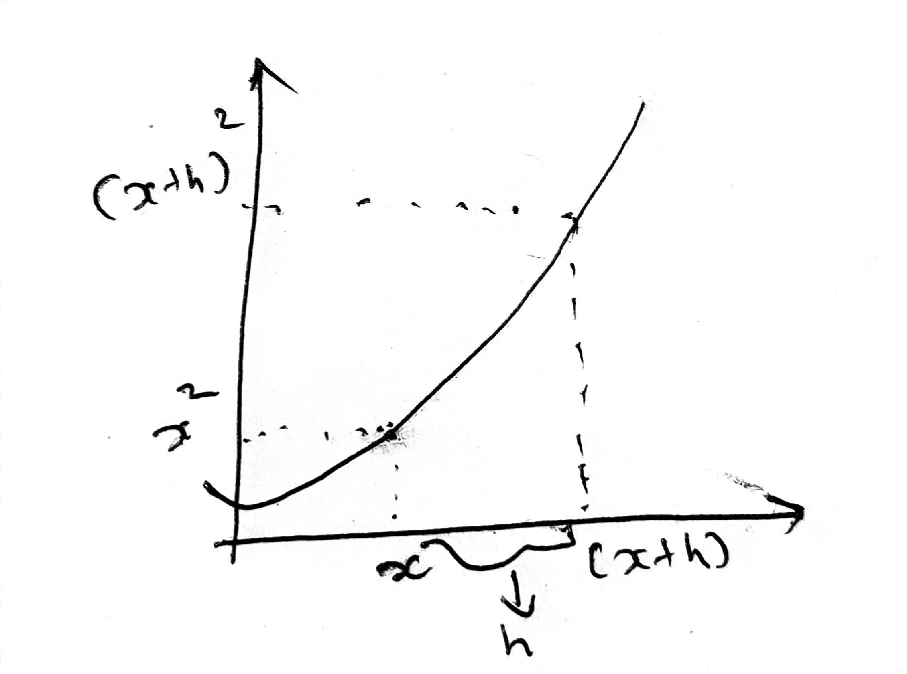

# Graphs  

The rounded area is called as intercept of the graph and the line is called as slope

Intercept means where the line is interact with graph quadrent

Slope can be a straight line, curved

The above graph is 2D(x,y) so the slope and intercept are called as `Line`. If the graph has 3D(x,y,z) it's name is `plane`. If the graph has more than 3D then it is called as `hyper plan`

# How this graph equation is used to predict values?

Consider `x` as *Hours of study* and `y` as *Marks scored* in the below graph

For the above graph equation is $y = mx + c$

`y` is the output  
`x` is the input  
`m` is slope value  
`c` is intercept  

From the Graph came to know . If study hour increase the mark also increase. In future if we give input x it can able to predict the output y

The above graph is one of the example of linear regression

`Machine Learning` is more suitable for Linear problems  
`Deep Learning` is more suitable for Linear and Non-Linear problems

`Linear` means the line is straight it has no turns  
`Non-Linear` means the line will have turns and it is not straight

# Slope
 

 A slope of a line is the change in y coordinate with respect to the change in x coordinate. In the above image blue line is called as slope

$$
  slope = \frac{(y2-y1)}{(x2 - x1)}
$$

Slope of the linear function is constant in any points and Slope of the non-linear function is vary for point to point

## Linear

Eg : 1
$$
(x1,y1) = (1,1) \\
(x2,y2) = (2,2) \\
slope = \frac{(y2-y1)}{(x2 - x1)} = \frac{(2-1)}{(2 - 1)} = \frac{1}{1} = 1\\
$$

Eg : 2
$$
(x1,y1) = (1,1) \\
(x2,y2) = (3,3) \\
slope = \frac{(y2-y1)}{(x2 - x1)} = \frac{(3-1)}{(3 - 1)} = \frac{2}{2} = 1\\
$$

## Non-Linear

Eg : 1
$$
(x1,y1) = (1,3) \\
(x2,y2) = (2,1) \\
slope = \frac{(y2-y1)}{(x2 - x1)} = \frac{(1-3)}{(2 - 1)} = \frac{-2}{1} = -2\\
$$

Eg : 2
$$
(x1,y1) = (1,3) \\
(x2,y2) = (1,2) \\
slope = \frac{(y2-y1)}{(x2 - x1)} = \frac{(2-3)}{(1 - 1)} = \frac{-1}{0} = \infty \\
$$

Slope values can be 0, +ve, -ve and $\infty$

# Derivation
Until now to calculate slope of needed 2 points, Now derive a formula to find the slope of the particular point

For this drivation use $y=x^2$ equation
 

If input is x value of output is $x^2$
For example  
1
$$
x = 5 \\
y = 5^2 = 25
$$

2
$$
x = 10 \\
y = 10^2 = 100
$$

if x is move by h distance from x then input will be $x+h$ and output will be $(x+h)^2$  
$slope = \frac{(y_2 - y_1)}{(x_2 - x_1)}\\$
$$
\begin{aligned}
x_1 = x\\
y_1 = x^2\\
x_2 = (x+h)\\
y_2 = (x+h)^2 \\

substitute \ the \ values \ to \ the \ equation \\
\\

slope = \frac{((x+h)^2 - x^2)}{( (x + h) - x)} \\
\\
= \frac{((x+h)^2 - x^2)}{( x + h - x)} \\

\\
`(x+h)^2 is\ similar\ to\ (a+b)^2`\\
``(a+b)^2 = a^2 + 2ab + b^2``\\
`From\ formula\ (x+h)^2 = x^2 + 2xh + h^2`\\
\\
= \frac{( x^2 + 2xh + h^2 - x^2)}{( x + h - x)} \\
\\
= \frac{( \cancel{x^2} + 2xh + h^2 \cancel{-x^2})}{( \cancel{x} + h \cancel{-x})} \\

\\
= \frac{ 2xh + h^2 }{h} \\

\\
Divide\ by\ \frac{h}{h} \\
\\
= 2x + h \\
\end{aligned}
$$
In the derivation the result is *$2x+h$*. Here the $h$ is very small so it can be negligible. So final answer is $2x$

when input is 5 it's output is 25 and it's slope is $2*x$ which is $2 * 5 =10$

This is the proof of how $\frac{\partial }{\partial x} = x^2 = 2x$